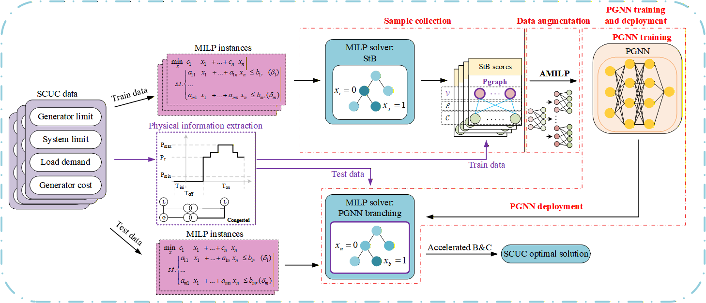

# Pgraph and AMILP for Accelerated Branching in SCUC
Security-Constrained Unit Commitment (SCUC) is essential for day-ahead market clearing and is typically formulated as a Mixed-Integer Linear Programming (MILP) problem, solved by branch-and-cut (B&C)-based solvers. While recent Graph Neural Network (GNN)-based branching strategies have shown promise, existing methods face two critical bottlenecks. First, generic mathematical features fail to capture the intrinsic physical characteristics of SCUC, limiting branching quality. Second, massive strong branching (StB) samples required for training on large-scale systems are computationally prohibitive. To address these challenges, this paper proposes a physics-informed graph neural network (PGNN) branching framework incorporating two novel modules:(i) a physics-enhanced graph (Pgraph); and (ii) an Augmented MILP (AMILP) method.

---

## Table of Contents

1. [Environment and Dependencies](./Environment_and_Dependencies/install.md)
2. [Sample Collection](03_generate_dataset_case118.py)
3. [Data Augmentation](***code to be released after paper acceptance***)
4. [PGNN Training](***code to be released after paper acceptance***)
5. [PGNN Deployment and Instance Testing](05_evaluate_case118_PD.py)

## Acknowledgments

This repository uses or draws inspiration from the following open-source projects:

- **Gasse et al. (NeurIPS 2019)** - Provides a generic bipartite graph representation for MILP, which serves as the foundation for constructing our Pgraph.
  - Paper: "Exact Combinatorial Optimization with Graph Convolutional Neural Networks"
  - Repository: https://github.com/ds4dm/learn2branch

- **Lin et al. (ICLR 2024)** - Provides the foundational AMILP idea, which is adapted in this work to augment branching samples for SCUC.
  - Paper: "CAMBranch: Contrastive learning with augmented MILPs for branching"
  - Author's GitHub: https://github.com/linjc16

We thank the authors for making their work publicly available.

## Contributor
[Peijie Li](lipeijie@gxu.edu.cn), a professor in Guangxi University, China. 
[Jiaming Li], a postgraduate in Guangxi University, China.
